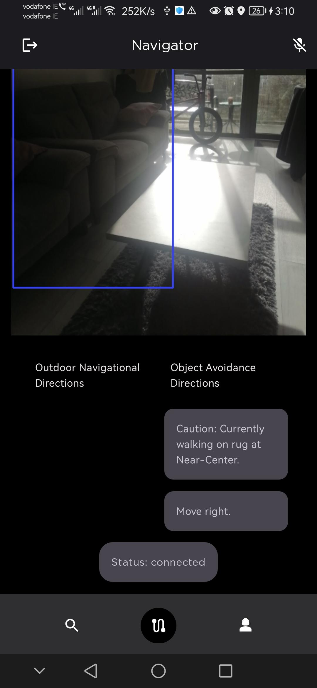
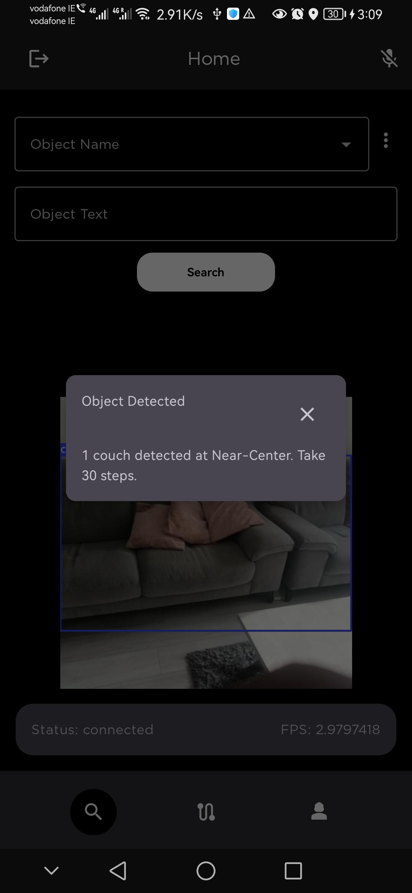

# **Himba Vision** 🦾👁️  
*A cost-effective visual assistance solution for visually impaired individuals*

## 📌 Overview  
Himba Vision is an **Android-based assistive application** designed to enhance **contextual awareness** for visually impaired individuals, enabling independent navigation. It leverages **computer vision technologies** to identify objects, read text, estimate distances, and provide spatial awareness—all in real time.

## 🔍 Key Features  
✅ **Offline Object Detection** using **NanoDet**  
✅ **Online Panoptic Segmentation** with **Detectron2’s Panoptic FPN**  
✅ **Text Recognition & Speech Interaction** 🗣️  
✅ **3x3 Grid Localization** for structured spatial awareness 📌  
✅ **Monocular Distance Estimation** for object proximity detection 📏  
✅ **Google Maps Integration** for geographical context 🗺️  

## 📱 Installation & Running the App  
1️ Load the project in **Android Studio**.  
2️ Connect an **actual Android device** for deployment (❌ **No emulators**).  
3️ Run the application.  

### ⚠️ Troubleshooting  
- If you encounter issues running the app, locate the **APK file** in the `build` directory and install it manually.  

## 🎭 Panoptic Segmentation Setup  
To enable **panoptic segmentation**, follow these steps:  
🔹 Create a **premium Ngrok account**.  
🔹 Load the **Jupyter Notebook** found in the server-side logic.  
🔹 Replace the existing **Ngrok key** with your **premium Ngrok key**.  
🔹 This will expose the **Kaggle/Colab notebook hardware resources** to the app for processing.  

## ⚙️ Notes  
🔹 Contact me on success_fred@yahoo.com to test panoptic segmentation.
🔹 Ensure you have the necessary dependencies installed in your environment.  
🔹 A **stable internet connection** is required for seamless communication between the app and cloud resources for panoptic segmentation.  

## 🖼️ Himba Vision Images 

  
  

#